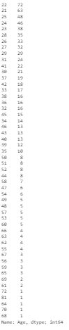
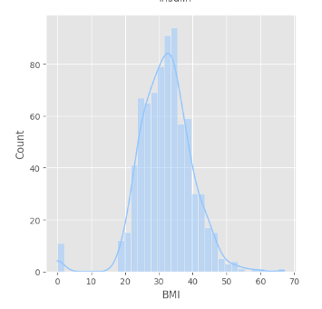
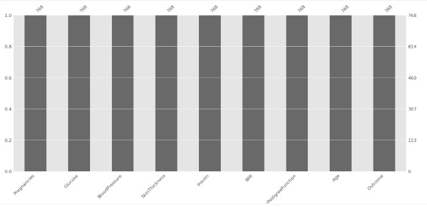
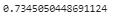

# Laporan Proyek Machine Learning
### Nama : Mawar Wiliyanti
### Nim : 211351080
### Kelas : IF Pagi A

## Domain Proyek
Proyek ini dirancang untuk mengembangkan model prediksi yang dapat menentukan apakah seorang pasien menderita diabetes atau tidak. Prediksi ini dibuat berdasarkan pengukuran diagnostik tertentu yang terdapat dalam kumpulan data yang digunakan. Kumpulan data ini mencakup sejumlah variabel, seperti jumlah kehamilan, kadar glukosa, tekanan darah, ketebalan kulit, insulin, indeks massa tubuh (BMI), fungsi diabetes pedigree, dan usia.

## Business Understanding

Memberikan prediksi dini terkait risiko diabetes berdasarkan data diagnostik dan Membantu individu dalam memantau kondisi kesehatan mereka sendiri.

Bagian laporan ini mencakup:

### Problem Statements

Semakin banyak orang yang menghadapi masalah dengan kesehatan terkait diabetes. Kita melihat bahwa banyak orang mungkin tidak menyadari risiko mereka terkena diabetes, dan ini bisa menjadi masalah serius.

### Goals

 menciptakan solusi yang dapat membantu kita memprediksi risiko diabetes pada seseorang sebelum kondisinya menjadi serius.

### Solution statements
- Merancang platform yang memungkinkan pengguna untuk menerima prediksi yang disesuaikan.

- Mengembangkan model prediktif yang dapat memprediksi risiko diabetes berdasarkan data diagnostik tertentu dengan menggunakan algoritma KNN.

## Data Understanding
Menggunakan dataset yang berasal dari kaggle yang berisi Prediksi Diabetes. terdiri dari 768 baris dan 9 kolom, yang mencakup berbagai variabel yang berkaitan dengan Diabetes dan faktor  lainnya<br> 

Contoh: [Pima Indians Diabetes Database](https://www.kaggle.com/datasets/uciml/pima-indians-diabetes-database).
 

### Variabel-variabel pada Pima Indians Diabetes Database adalah sebagai berikut:
- Pregnancies : Menunjukkan jumlah berapa kali seseorang telah hamil
- Glucose : Konsentrasi glukosa plasma 2 jam dalam tes toleransi glukosa oral
- Blood Pressure: Tekanan darah diastolik (mm Hg)
- SkinThickness : Ketebalan lipatan kulit trisep (mm)
- Insulin : Kadar insulin serum dalam darah (mu U/ml)
- DiabetsPedigreeFunction : Skor atau kemungkinan diabetes berdasarkan riwayat keluarga
- BMI : Indeks massa tubuh (berat badan dalam kg/(tinggi badan dalam m)^2)
- Age : Umur dalam Tahun
- Outcome : 0 (tidak menderita diabetes) atau 1 (menderita diabetes)


## Data Preparation
### Data collecting
untuk data yang digunakan saya menggunakan dataset dengan nama Pima Indians Diabetes Database Dataset yang didapat dari website kaggle.

### Import Dataset
Pertama-tama kita import file dan mengupload token yang di download dari kaggle terlebih dahulu agar kita bisa mendownload file dataset dari kaggle melalui google.colab

```python
from google.colab import files
files.upload()
```
 selanjutnya kita akan membuat folder untuk menyimpan file kaggle.json yang sudah diupload

 ```python
 !mkdir -p ~/.kaggle
!cp kaggle.json ~/.kaggle/
!chmod 600 ~/.kaggle/kaggle.json
!ls ~/.kaggle
 ```
selanjutnya kita download datasetnya dengan code berikut

```python
!kaggle datasets download uciml pima-indians-diabetes-database
```
lalu kita extract file yang telah kita download tadi

```python
!mkdir pima-indians-diabetes-database
!unzip pima-indians-diabetes-database.zip -d pima-indians-diabetes-database
!ls pima-indians-diabetes-database
```
### Import Library
Disini kita import library yang akan kita digunakan nantinya

```python
import pandas as pd
import numpy as np
import matplotlib.pyplot as plt
import seaborn as sns
import matplotlib.pyplot as pb
import missingno as msno
import statistics
from sklearn.model_selection import GridSearchCV
from sklearn.metrics import accuracy_score
from sklearn.metrics import classification_report
from mlxtend.plotting import plot_decision_regions
plt.style.use('ggplot')
import warnings
warnings.filterwarnings('ignore')
%matplotlib inline
```

### Data Discovery
Kita masukkan file csv yang telah kita extract tadi

```python
df= pd.read_csv('pima-indians-diabetes-database/diabetes.csv')
```
lihat 5 baris teratas
```python
df.head()
```


lihat type data pada masing-masing atribut
```python
df.info()
```


kita lihat ringkasan statistik untuk setiap kolom dalam dataframe
```python
df.describe()
```


selanjutnya kita akan memanggil satu baris acak dari dataframe dengan code berikut
```python
df.sample()
```


lalu kita akan menampilkan jumlah kemunculan setiap nilai unik dalam kolom 'Outcome', 'Pregnancies', 'Glucose', 'Blood Pressure', 'SkinThickness', 'Insulin', 'BMI', 'DiabetesPedigreeFunction', 'Age'.
```python
df['Outcome'].value_counts()
```


```python
df['Pregnancies'].value_counts()
```


```python
df['Glucose'].value_counts()
```


```python
df['Blood Pressure'].value_counts()
```


```python
df['SkinThickness'].value_counts()
```


```python
df['Insulin'].value_counts()
```


```python
df['BMI'].value_counts()
```


```python
df['DiabetesPedigreeFunction'].value_counts()
```


```python
df['Age'].value_counts()
```


### EDA
kita lihat heatmap korelasi untuk kolom-kolom numerik dalam DataFrame menggunakan Seaborn dan Matplotlib.
```python
correlation_matrix = df.corr()
plt.figure(figsize=(8, 6))
sns.heatmap(correlation_matrix, cmap="Blues", annot=True)
plt.title('Correlation Heatmap of the Pima Indian Diabetes Dataset')
plt.show()
```


Distribusi dari Outcome
```python
import matplotlib.style as style
style.available

style.use('seaborn-pastel')
labels = ["Healthy", "Diabetic"]
df['Outcome'].value_counts().plot(kind='pie',labels=labels, subplots=True,autopct='%1.0f%%', labeldistance=1.2, figsize=(4,4))
```


Distribusi pada masing-masing kolom
```python
import seaborn as sns
for i in df.columns[0:-1] :
    sns.displot(data=df, x=i, kde=True)
```





distribusi 'BMI' berdasarkan hasil kesehatan ('Outcome')
```python
plt.figure(figsize=(5,4))
sns.boxplot(y=df['BMI'],x=df['Outcome'],palette='OrRd_r',saturation=0.8)
plt.tight_layout()
plt.grid(True)
plt.show()
```


memeriksa apakah terdapat baris yang kosong atau null pada dataset kita
```python
import missingno as msno
msno.bar(df);
```


## Data Preparation
selanjutnya kita lihat mana kolom yang categorical dan mana kolom yang numerical
```python
numerical = []
catgcols = []

for col in df.columns:
  if df[col].dtype=="float64":
    numerical.append(col)
  else:
    catgcols.append(col)

  for col in df.columns:
    if col in numerical:
      df[col].fillna(df[col].median(), inplace=True)
    else:
      df[col].fillna(df[col].mode(), inplace=True)
```
```python
numerical
```


```python
catgcols
```


selanjutnya seleksi fitur, kita akan memilih kolom apa yang dijadikan fitur dan kolom apa yang dijadikan target.
```python
features = ['Pregnancies', 'Glucose', 'BloodPressure', 'SkinThickness',	'Insulin', 'BMI', 'DiabetesPedigreeFunction', 'Age']
x = df[features]
y = df['Outcome']
print(x.shape)
print(y.shape)
```


## Modeling
Pada Tahap ini kita akan melakukan split data, kita masukkan kodenya
```python
from sklearn.model_selection import train_test_split
X_train,X_test,y_train,y_test = train_test_split(X,y,test_size=0.4,random_state=42, stratify=y)
```

Mari kita buat sebuah pengklasifikasi menggunakan algoritma knn.

Pertama, mari kita amati dulu akurasi untuk berbagai nilai k

```python
from sklearn.neighbors import KNeighborsClassifier

test_accuracies = []
train_accuracies = []

for n_neighbors in range(1, 10):
    knn = KNeighborsClassifier(n_neighbors)
    knn.fit(X_train,y_train)
    train_accuracies.append(knn.score(X_train,y_train))
    test_accuracies.append(knn.score(X_test,y_test))
```

Buat plot untuk akurasi training dan testing di mana x adalah jumlah neighbors dan y adalah akurasi
```python
plt.figure(figsize=(11,6))

plt.plot(range(1, 10),train_accuracies,marker='*',label='Train Score')
plt.plot(range(1, 10),test_accuracies,marker='o',label='Test Score')
plt.xlabel('Number of neighbors',size='15')
plt.ylabel('Accuracy',size='15')
plt.text(6.7,0.75, 'Here!')
plt.grid()
plt.legend()
plt.show()
```


Kita bisa melihat di atas bahwa kita mendapatkan akurasi testing maksimum untuk k=7. Jadi, mari kita buat sebuah KNeighborsClassifier dengan jumlah neighbors sebanyak 7.
```python
knn = KNeighborsClassifier(n_neighbors=7)
```
```python
knn.fit(X_train,y_train)
```


kita lihat akurasi knn untuk k = 7
```python
print('Akurasi =', knn.score(X_test,y_test))
```


selanjutnya mari kita uji dengan confusion matrix
```python
from sklearn.metrics import confusion_matrix
```
```python
y_pred = knn.predict(X_test)
confusion_matrix(y_test,y_pred)
```


```python
sns.heatmap((confusion_matrix(y_test,y_pred)), annot=True, cmap="YlGnBu" ,fmt='g')
plt.title('Confusion matrix', y=1.05)
plt.ylabel('Actual label')
plt.xlabel('Predicted label')
plt.show()
```


True Positive (TP): Jumlah data positif yang diprediksi dengan benar. Pada matriks ini adalah nilai 60 yang berada pada kolom "1" dan baris "1".

- True Negative (TN): Jumlah data negatif yang diprediksi dengan benar. Di sini, nilai 165 yang berada pada kolom "0" dan baris "0".

- False Positive (FP): Jumlah data negatif yang salah diprediksi sebagai positif. Nilai ini ada pada kolom "1" dan baris "0" (60).

- False Negative (FN): Jumlah data positif yang salah diprediksi sebagai negatif. Nilai ini terdapat pada kolom "0" dan baris "1" (47).

selanjutnya kita akan gunakan kurva ROC
- gunakan predict_proba dari knn
```python
y_pred_proba = knn.predict_proba(X_test)[:,1]
```
```python
from sklearn.metrics import roc_curve
fpr, tpr, thresholds = roc_curve(y_test, y_pred_proba)
```
```python
plt.plot([0,1],[0,1],'g--')
plt.plot(fpr,tpr)
plt.xlabel('FPR')
plt.ylabel('TPR')
plt.title('ROC curve (kNN(n_neighbors=7))')
plt.show()
```


plot di atas menghasilkan plot yang memvisualisasikan kurva Receiver Operating Characteristic (ROC) untuk sebuah klasifikasi kNN dengan n_neighbors=7. membantu mengevaluasi kompromi antara sensitivitas (True Positive Rate) dan spesifisitas (True Negative Rate) pada berbagai nilai ambang batas untuk klasifikasi tersebut. Garis hijau dengan pola putus-putus mewakili kurva ROC untuk klasifikasi acak, berfungsi sebagai dasar perbandingan.


menghitung area di bawah kurva ROC
```python
from sklearn.metrics import roc_auc_score
roc_auc_score(y_test,y_pred_proba)
```


selanjutnya kita akan melakukan proses tuning parameter menggunakan GridSearch untuk menentukan kombinasi parameter yang memberikan kinerja model terbaik.

```python
error_rate = []

for i in range(1,40):

    knn = KNeighborsClassifier(n_neighbors=i)
    knn.fit(X_train,y_train)
    pred_i = knn.predict(X_test)
    error_rate.append(np.mean(pred_i != y_test))
```
```python
param_grid = {'n_neighbors':np.arange(1,50)}
knn = KNeighborsClassifier()
knn_cv= GridSearchCV(knn,param_grid,cv=5)
knn_cv.fit(X,y)
```


hitung best score dari knn
```python
print("Best Score:" + str(knn_cv.best_score_))
```


hitung parameter terbaik dari knn
```python
print("Best Parameters: " + str(knn_cv.best_params_))
```


setelah dilakukan grid search parameter terbsik yaitu K=14 dan Best Scorenya adalah 0.7578 atau 76%

### simulasi model 
Selanjutnya kita akan Membuat inputan dari model knn
```python
input_data = np.array([[0,111,65,0,0,24.6,66,70]])
prediction = model.predict(input_data)
print(prediction)

if(prediction[0]==0):
  print ('Pasien tidak terkena diabetes')
else:
  print ('Pasien terkena diabetes')
```


### Visualisasi Hasil Algoritma
Kita coba menggunakan plot decision region
```python
value = 20000
width = 20000
plot_decision_regions(X.values, y.values, clf=model, legend=2,
                      filler_feature_values={2: value, 3: value, 4: value, 5: value, 6: value, 7: value},
                      filler_feature_ranges={2: width, 3: width, 4: width, 5: width, 6: width, 7: width},
                      X_highlight=X_test.values)

plt.title('KNN with Diabetes Data')
plt.show()
```


selanjutnya kita mengimplementasikan algoritma K-Nearest Neighbors (KNN) untuk memprediksi kategori target ("Outcome") berdasarkan nilai fitur 'Insulin' dan 'BMI' dari dataset.
```python
import statistics

def knn_algorithm(k, x1, x2):
    euclidean_distance = []

    for i in range(df.shape[0]):
        euclidean_distance.append(np.sqrt(np.dot(df.iloc[i].values[:2] - [x1, x2], df.iloc[i].values[:2] - [x1, x2])))

    index = np.argsort(euclidean_distance)
    index = index[:k]
    label = [df.Outcome.iloc[i] for i in index]
    label = statistics.mode(label)

    palette = sns.color_palette("husl", 2)
    colors = {0: palette[0], 1: palette[1]}

    fig, ax = plt.subplots(figsize=(15, 8))
    sns.scatterplot(data=df, x='Insulin', y='BMI', hue='Outcome',
                    alpha=0.9, s=250, palette=palette, ax=ax)

    for i in index:
        target_value = df.Outcome.iloc[i]
        if isinstance(target_value, (int, float)):
            color = colors[int(target_value)]
        else:
            color = 'gray'
        ax.scatter(x=df['Insulin'].iloc[i], y=df['BMI'].iloc[i], s=250, alpha=0.6, linewidth=2, edgecolor='k', color=color)

    ax.scatter(x=x1, y=x2, s=400, marker='*', color='k')
    ax.set_title(label=f'K-Nearest Neighbor with K = {k}', fontsize=14)
    ax.set_axis_off()
    plt.show()

    return f'Predictions: {label}'

k_value = 14
x1_value = 60
x2_value = 0

result = knn_algorithm(k_value, x1_value, x2_value)
print(result)
```


## Evaluation
Pada bagian ini kita menggunakan F1 Score sebagai Metric evaluasi.
- F1 Score adalah ukuran kinerja yang umumnya cocok untuk evaluasi model klasifikasi, termasuk model K-Nearest Neighbors (KNN). F1-score berguna ketika memiliki kelas yang tidak seimbang (imbalance), di mana jumlah instance dari kelas positif dan kelas negatif berbeda signifikan.

- F1 Score dihitung menggunakan rumus :


dimana :


Setelah itu kita akan menerapkannya dalam kode menggunakannya dalam metode classification, sebagai berikut :
```python
from sklearn.metrics import classification_report, confusion_matrix
print(classification_report(y_test, y_pred))
```


Dalam kasus ini, akurasi adalah 73%, yang merupakan rasio dari jumlah prediksi benar (True Positives + True Negatives) dibagi dengan total jumlah instance.

## Deployment
[Predict Diabet App](https://predict-diabet.streamlit.app/)


